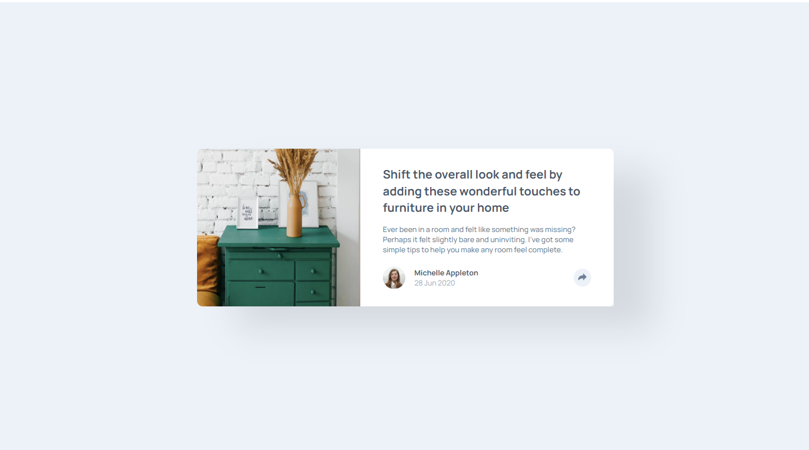
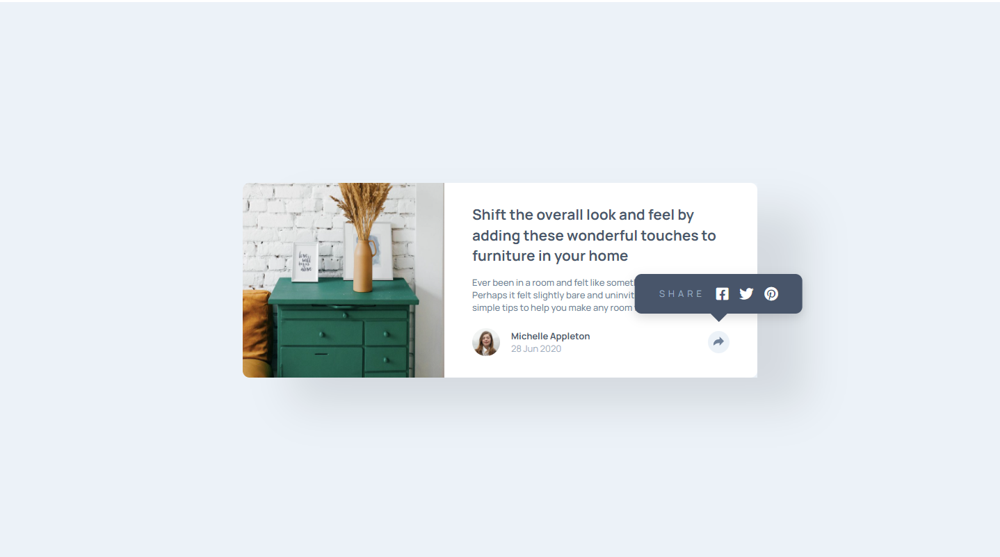
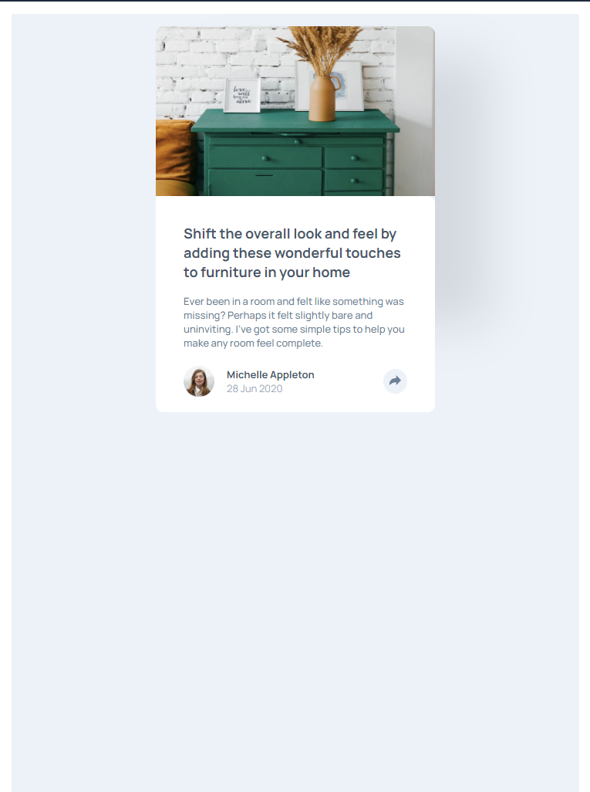
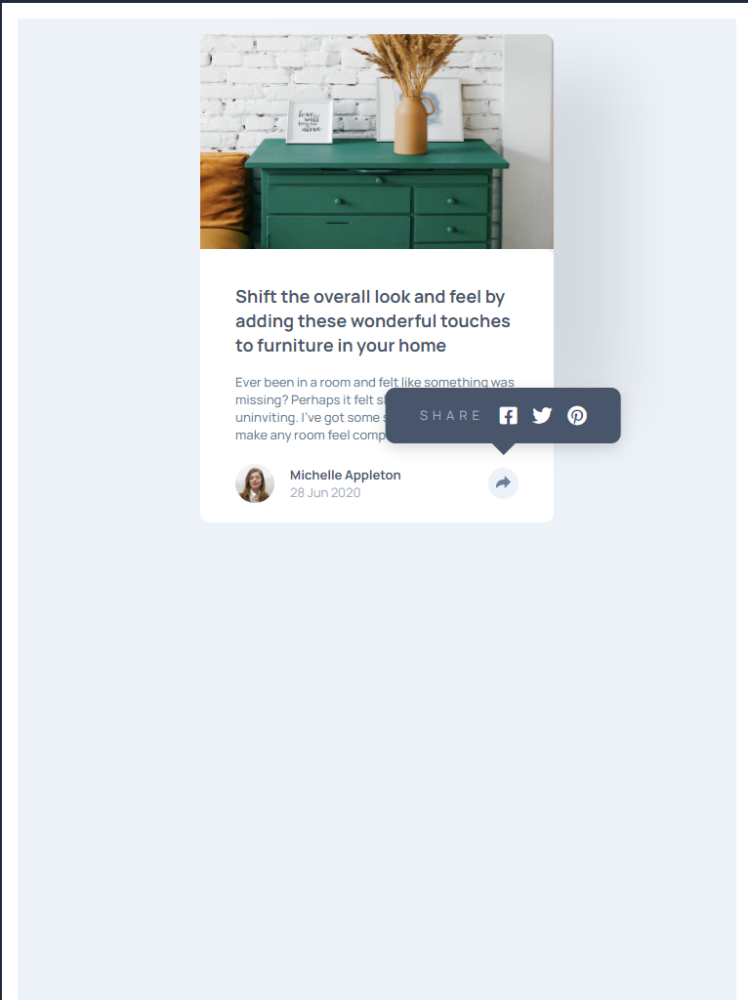
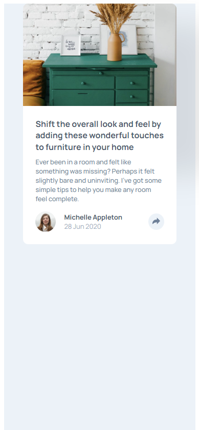
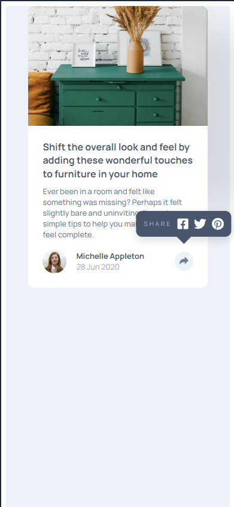

# Frontend Mentor - Article preview component solution

This is a solution to the [Article preview component challenge on Frontend Mentor](https://www.frontendmentor.io/challenges/article-preview-component-dYBN_pYFT). Frontend Mentor challenges help you improve your coding skills by building realistic projects.

## Table of contents

- [Overview](#overview)
  - [The challenge](#the-challenge)
  - [Screenshot](#screenshot)
  - [Links](#links)
- [My process](#my-process)
  - [Built with](#built-with)
  - [What I learned](#what-i-learned)
  - [Continued development](#continued-development)
  - [Useful resources](#useful-resources)
- [Author](#author)
- [Acknowledgments](#acknowledgments)

**Note: Delete this note and update the table of contents based on what sections you keep.**

## Overview

### The challenge

Users should be able to:

- View the optimal layout for the component depending on their device's screen size
- See the social media share links when they click the share icon

### Screenshot








### Links

- Solution URL: [Add solution URL here](https://your-solution-url.com)
- Live Site URL: [Add live site URL here](https://your-live-site-url.com)

## My process

### Built with

- Semantic HTML5 markup
- CSS custom properties
- Flexbox
- CSS Grid
- Mobile-first workflow

### What I learned

I learned to use better the grid and flexbox properties, so how to adjust the components in the responsive designs.

```html
<body>
  <main class="main">
    <article class="container">
      
      <div class="text">
        <p class="title">
          Shift the overall look and feel by adding these wonderful touches to
          furniture in your home
        </p>
        <p class="description">
          Ever been in a room and felt like something was missing? Perhaps it
          felt slightly bare and uninviting. I’ve got some simple tips to help
          you make any room feel complete.
        </p>
        <div class="footer">
          <div class="author-info">
            
            <div class="name-date">
              <p class="name">Michelle Appleton</p>
              <p class="date">28 Jun 2020</p>
            </div>
          </div>
          <div class="share-container">
            <!-- El tooltip con los iconos sociales (inicialmente oculto) -->
            <div id="social" class="social-tooltip">
              <span>SHARE</span>
              <a href="#" aria-label="Share on Facebook"
                ><i class="fab fa-facebook-square" style="color: #ffffff"></i
              ></a>
              <a href="#" aria-label="Share on Twitter"
                ><i class="fab fa-twitter" style="color: #ffffff"></i
              ></a>
              <a href="#" aria-label="Share on Pinterest"
                ><i class="fab fa-pinterest" style="color: #ffffff"></i
              ></a>
            </div>

            <!-- El botón que activa el tooltip -->
            <button
              id="button-social"
              class="share-button"
              aria-label="Show share options"
            >
              <svg xmlns="http://www.w3.org/2000/svg" width="15" height="13">
                <path
                  fill="#fff"
                  d="M15 6.495L8.766.014V3.88H7.441C3.33 3.88 0 7.039 0 10.936v2.049l.589-.612C2.59 10.294 5.422 9.11 8.39 9.11h.375v3.867L15 6.495z"
                />
              </svg>
            </button>
          </div>
        </div>
      </div>
    </article>
  </main>
</body>
```

```css
.proud-of-this-css {
  color: papayawhip;
}
```

```js
const proudOfThisFunc = () => {
  console.log("🎉");
};
```

If you want more help with writing markdown, we'd recommend checking out [The Markdown Guide](https://www.markdownguide.org/) to learn more.

**Note: Delete this note and the content within this section and replace with your own learnings.**

### Continued development

Use this section to outline areas that you want to continue focusing on in future projects. These could be concepts you're still not completely comfortable with or techniques you found useful that you want to refine and perfect.

**Note: Delete this note and the content within this section and replace with your own plans for continued development.**

### Useful resources

- [Example resource 1](https://www.example.com) - This helped me for XYZ reason. I really liked this pattern and will use it going forward.
- [Example resource 2](https://www.example.com) - This is an amazing article which helped me finally understand XYZ. I'd recommend it to anyone still learning this concept.

**Note: Delete this note and replace the list above with resources that helped you during the challenge. These could come in handy for anyone viewing your solution or for yourself when you look back on this project in the future.**

## Author

- Website - [Add your name here](https://www.your-site.com)
- Frontend Mentor - [@yourusername](https://www.frontendmentor.io/profile/yourusername)
- Twitter - [@yourusername](https://www.twitter.com/yourusername)

**Note: Delete this note and add/remove/edit lines above based on what links you'd like to share.**

## Acknowledgments

This is where you can give a hat tip to anyone who helped you out on this project. Perhaps you worked in a team or got some inspiration from someone else's solution. This is the perfect place to give them some credit.

**Note: Delete this note and edit this section's content as necessary. If you completed this challenge by yourself, feel free to delete this section entirely.**
